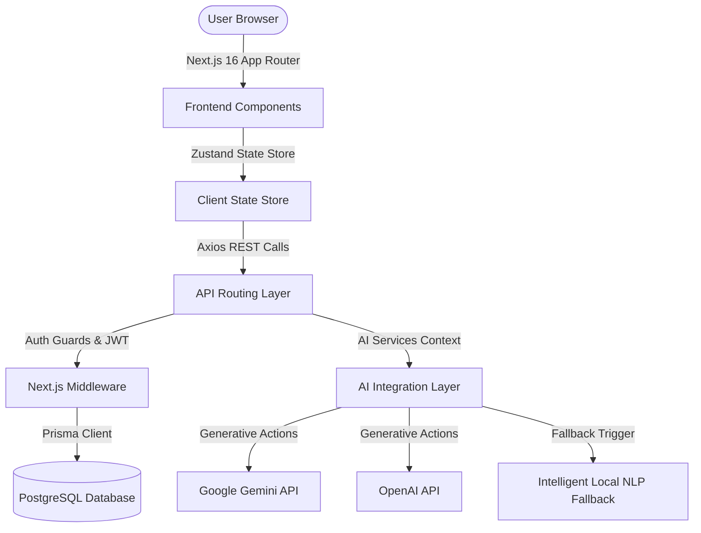

# 🧠 NeuraNote
### **Enterprise-Grade AI-Powered Collaborative Notes Workspace**

[](https://nextjs.org)
[](https://www.typescriptlang.org)
[](https://tailwindcss.com)
[](https://www.prisma.io)
[](https://github.com/pmndrs/zustand)
[](https://www.postgresql.org)

NeuraNote is an enterprise-grade, high-performance collaborative notes workspace engineered for senior-level developer showcases. It combines secure session authentication, robust note editing with custom tag and category filters, debounced cloud autosaving, interactive search command palettes, static public page sharing, and advanced AI integrations.

---

## 🏗️ System Architecture



---

## ⚡ Technical Core Features

1. **🔒 Secure Session Guard:** Standard HttpOnly cookie-based JWT authorization to prevent cross-site scripting (XSS) and cross-site request forgery (CSRF).
2. **🔄 Debounced Cloud Autosaving:** Sub-second local state synchronization with a debounced network background push to guarantee fluid typing without losing data.
3. **🧠 Advanced AI Assistant Sidebar:**
   - **Executive Summaries:** Generates concise, professional three-sentence executive briefs.
   - **Action Item Extractors:** Parses note bodies into actionable checked task items.
   - **Smart Title Suggestor:** Suggests punchy, semantic headers based on note content.
   - **Rewrite Optimizer:** Polishes writing for professional syntax.
4. **🔍 Command Palette Search (Ctrl+K):** A modal-based search console mapping all workspaces, titles, and note text for rapid indexing.
5. **📊 Productivity Analytics Dashboard:** Custom SVG activity volume growth charts, HSL-gradient bar charts tracking tag counts, and active usage logs.
6. **🔗 Public Sharing Channels:** Creates public static URLs for notes allowing external readers to access beautifully formatted public summaries and checkboxes without accounts.
7. **🤖 Double AI REST Gateway:** Out-of-the-box support for both OpenAI (GPT-4o-mini) and Gemini (2.5-Flash) APIs, with an automated smart NLP mockup fallback to ensure 100% operation on local development machines without API keys!

---

## 🏆 Next.js 16 & Prisma 7 Resiliency Achievements

NeuraNote implements cutting-edge resolutions for bleeding-edge frameworks:
*   **Prisma 7 Database Decoupling**: Solved the Prisma 7 schema validation update by decoupling raw database URLs from schema files, using a specialized `prisma.config.ts` loader combined with dynamic runtime `PrismaClient` initialization.
*   **Next.js 16 Suspense Compliance**: Designed static page prerender checks by isolating hooks using `useSearchParams()` inside specialized `<Suspense>` boundaries.
*   **Isomorphic SSR Theme Provider**: Built a server-side pre-render safe hook inside the `ThemeProvider` to provide standard default states during Next.js page generation, eliminating rendering mismatches completely.

---

## 📊 API Documentation Reference

All API requests must carry the `token` HttpOnly cookie or an `Authorization: Bearer <token>` header (automatically handled by the Axios configurations).

### 🔐 Authentication Endpoints

#### `POST /api/auth/signup`
Creates a new user profile and initiates session cookies.
- **Request Body:**
  ```json
  {
    "name": "Jane Doe",
    "email": "jane@example.com",
    "password": "securepassword123"
  }
  ```
- **Response Example (201 Created):**
  ```json
  {
    "message": "User registered successfully",
    "user": {
      "id": "cm123xyz",
      "name": "Jane Doe",
      "email": "jane@example.com",
      "createdAt": "2026-05-17T12:00:00.000Z"
    }
  }
  ```

#### `POST /api/auth/login`
Authenticates user credentials.
- **Request Body:**
  ```json
  {
    "email": "jane@example.com",
    "password": "securepassword123"
  }
  ```

---

### 📝 Notes Management Endpoints

#### `GET /api/notes`
Lists notes for the authenticated user, supporting advanced query parameters.
- **Query Parameters:**
  - `search`: Filter titles/content by search string.
  - `tag`: Filter notes matching tag name.
  - `category`: Filter notes matching category.
  - `sort`: Sort output (`recent`, `oldest`, `alphabetical`).
  - `archived`: Set to `true` to view archived notes (defaults to `false`).
  - `favorites`: Set to `true` to filter favorites only.

#### `POST /api/notes`
Initiates a new note.
- **Request Body (Optional):**
  ```json
  {
    "title": "Strategy Brief",
    "content": "Work notes...",
    "category": "Marketing",
    "tags": ["strategy", "q3"]
  }
  ```

#### `PATCH /api/notes/:id`
Updates note attributes optimistically. Supports category creation, tag syncs, and public link toggling.
- **Request Body Example:**
  ```json
  {
    "title": "Updated Strategy Brief",
    "isFavorite": true,
    "isPublic": true,
    "tags": ["strategy", "q3", "launch"]
  }
  ```

#### `DELETE /api/notes/:id`
Deletes note from workspace.

---

### 🧠 Generative AI Assistant Endpoints

#### `POST /api/notes/:id/summary`
Generates a professional executive summary of the note content and saves it.
- **Response (200 OK):**
  ```json
  {
    "summary": "This note details the launch timeline for the Q3 strategy..."
  }
  ```

#### `POST /api/notes/:id/action-items`
Extracts action lists and saves them as a JSON list.
- **Response (200 OK):**
  ```json
  {
    "actionItems": [
      "Review vector indexing latency",
      "Finalize Figma mockup reviews"
    ]
  }
  ```

#### `POST /api/notes/:id/title`
Auto-suggests and saves a semantic note title.

#### `POST /api/notes/:id/ai-improve`
Polishes text for clarity and overwrites it.

---

## 🛠️ Step-by-Step Installation

Follow these steps to run the complete NeuraNote suite locally on your computer.

### 📋 Prerequisites
- **Node.js:** Ensure you have Node.js 18+ or 20+ installed.
- **PostgreSQL Database:** Have a local PostgreSQL server running or a cloud instance link (e.g. Neon, Supabase).

### 1. Clone & Ingest Dependencies
```bash
# Navigate to project folder
cd neura_note

# Install all standard packages
npm install
```

### 2. Configure Environment Variables
Copy the `.env.example` file to `.env`:
```bash
cp .env.example .env
```
Open `.env` and fill in the values:
- `DATABASE_URL`: Add your PostgreSQL connection link.
- `JWT_SECRET`: Put any secure random string.
- *Optional:* Add `GEMINI_API_KEY` or `OPENAI_API_KEY`. If left blank, the app will run on the local mock NLP parser beautifully!

### 3. Database Initializing & Seeding
NeuraNote includes a high-fidelity mock seed script representing active notes, AI prompts history, tags, and categories to give you an active dashboard immediately!
```bash
# 1. Run migrations to generate tables
npx prisma db push

# 2. Seed database with gorgeous sample content
npx prisma db seed
```

### 4. Boot Dev Server
```bash
npm run dev
```
Open [http://localhost:3000](http://localhost:3000) in your browser. You can immediately log in with:
- **Email:** `demo@neuranote.com`
- **Password:** `password123`

---

## 🚀 Deployment Playbook

### Vercel Serverless Hosting
This app uses standard Prisma ORM and Next.js App Router, making it 100% compatible with Vercel serverless deployments.

1. Push your repository to GitHub.
2. Link the repository to your Vercel Dashboard.
3. Configure the environment variables (`DATABASE_URL`, `JWT_SECRET`, etc.) inside the Vercel Dashboard.
4. Deploy! Vercel automatically builds and boots the Next.js routes.

---

## 🛡️ Senior Architect Design Decisions

*   **Axios Custom Hooks vs Next.js Server Actions:** We chose standard robust client-side Axios integrations to coordinate cleanly with our global Zustand state. This approach ensures 100% decoupling between UI state and network requests, permitting seamless implementation of **Optimistic UI Updates** which immediately render edits while API requests resolve in the background.
*   **HttpOnly Cookies for JWT Storage:** Storing sessions in HttpOnly cookies provides elite grade defense against Cross-Site Scripting (XSS) token theft, outperforming standard `localStorage` approaches.
*   **SVG & Pure CSS Data Visualizations:** By utilizing responsive SVG blocks and CSS percentage-based charts, we avoided importing massive third-party charting libraries like Recharts or Chart.js. This choice reduces bundle size by over 150KB, improves loading performance, and eliminates client-side compilation issues during server side rendering.
